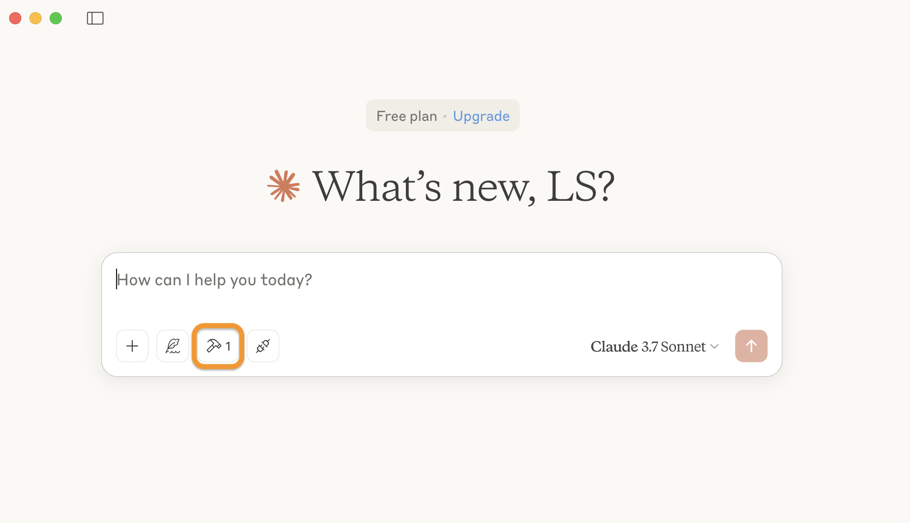
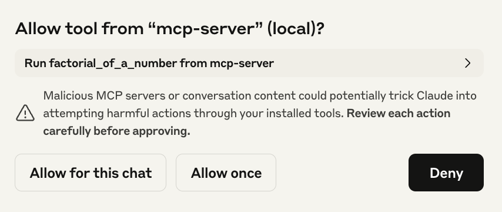
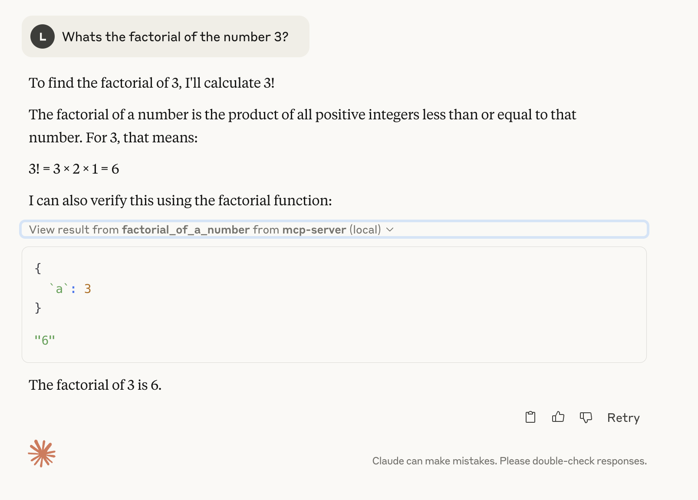
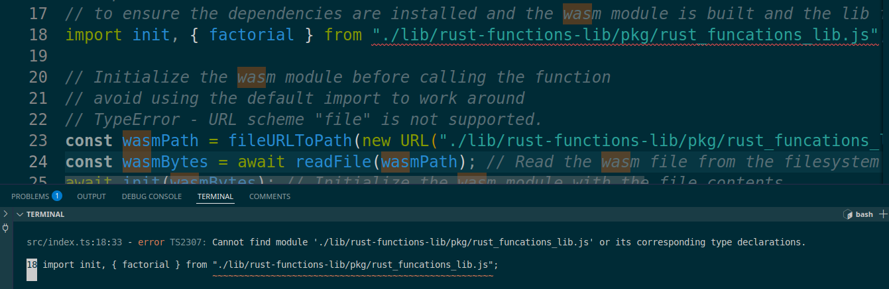

A simple Rust function integrated with an MCP client.

## Step 1: Relase the Rust & Javascript/TS code

### Release
```sh
npm run build:wasm:release // release rust code
npm install // create javascript file and install all npm dependencies
```

## Step 2: Claude Desktop Configuration

Create a configuration file at:

```json
{
  "mcpServers": {
    "mcp-server": {
      "command": "node",
      "args": [
        "[your local path]/mcpserver/build/index.js"
      ]
    }
  }
}
```

locations:

- macOS: `~/Library/Application Support/Claude/claude_desktop_config.json`
- Windows: `%APPDATA%\Claude\claude_desktop_config.json`
(source: https://modelcontextprotocol.info/docs/quickstart/user/#2-add-the-filesystem-mcp-server)

## Step 3: Claude Desktop

Start Claude Desktop


<sub>please note the additional mcp server icon in the frontend<sub>

Agree to use the mcp server function:



Observe the mcp server function:



## Misc

### Test the rust code

```sh
npm run test:rust
```

or

```sh
cd src/lib/rust-functions-lib
cargo test && cargo fmt --all -- --check
```

### Clean the output files and folders

```sh
npm run clean
```

### Build the rust code - alternatives

npm
```sh
npm run build:wasm

```

Alternative approach using wasm tool
```sh
cd src/lib/rust-functions-lib
wasm-pack build --target bundler
```

### Build only ts code (npm)

```sh
npm build
```

### Copy build Rust code
manual copy to the correct location - included in `npm run build:wasm:release`

```sh
mkdir -p build/lib/rust-functions-lib/pkg && cp src/lib/rust-functions-lib/pkg/rust_funcations_lib.js build/lib/rust-functions-lib/pkg/rust_funcations_lib.js
```

### Rust import failed

issue:



solution:

run `npm run build:wasm:release` to release the wasm-binding the factorial import depends on